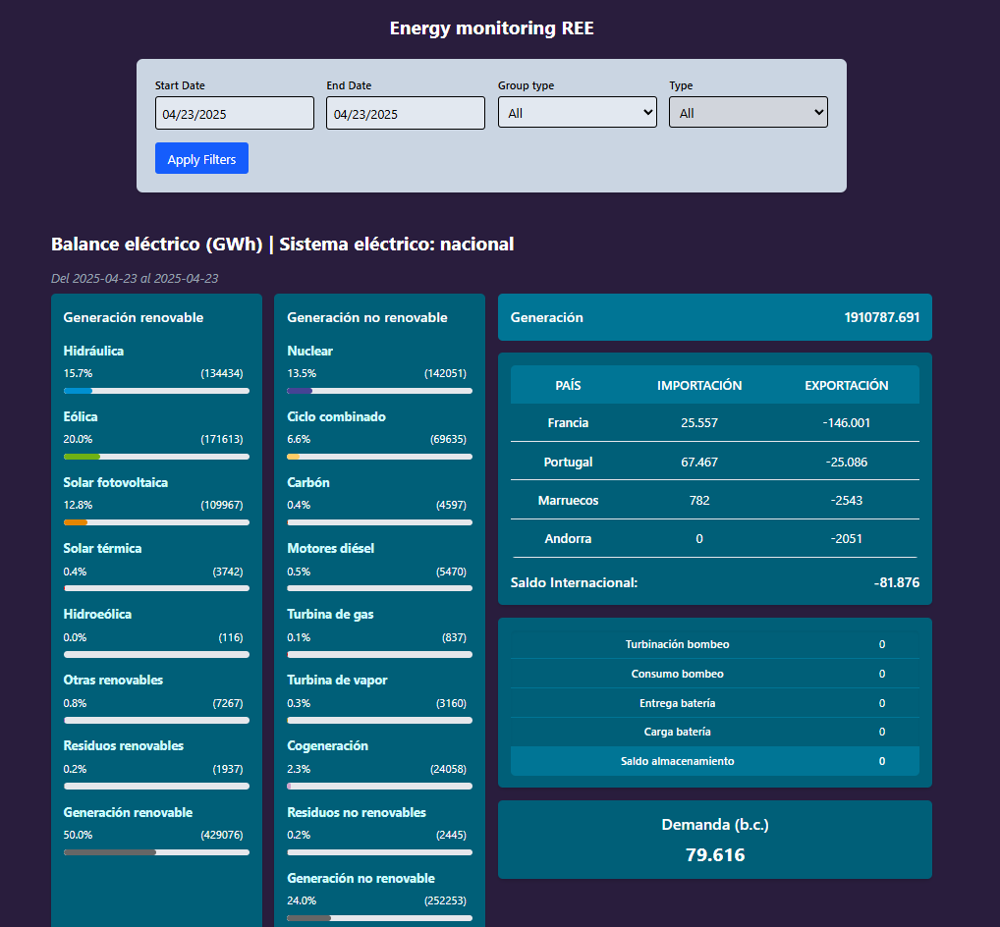
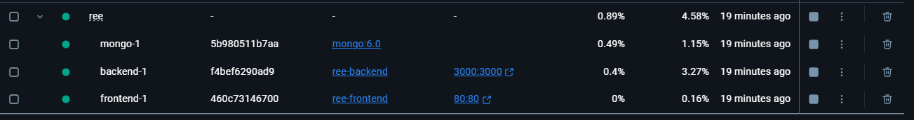

# Balance Eléctrico Nacional - Energy monitoring REE



## Descripción General

Este proyecto es una aplicación fullstack que consume datos de la API de REE (Red Eléctrica de España) para visualizar el balance eléctrico del sistema nacional a través de gráficos y descripciones en tarjetas. La interfaz de usuario, construida con React, permite a los usuarios filtrar los datos por rango de fechas y tipo de energía para un análisis detallado. El backend, desarrollado con NestJS, se encarga de consumir y exponer los datos de la API de REE a través de GraphQL.

## Arquitectura del Proyecto

La arquitectura del proyecto se divide en dos partes principales:

```
└── backend/ (Código fuente y configuración del backend NestJS)
├── .env (Variables de entorno del backend)
├── docker-compose.yml (Configuración de Docker para el backend)
├── dockerfile (Definición de la imagen de Docker para el backend)
├── src/ (Código fuente del backend)
│   ├── app.controller.ts
│   ├── app.module.ts
│   ├── app.service.ts
│   └── energy-balance/ (Módulo para la lógica del balance energético)
│       ├── dto/ (Data Transfer Objects)
│       ├── energy-balance.controller.ts
│       ├── energy-balance.module.ts
│       ├── resolvers/ (Resolvers de GraphQL)
│       ├── schemas/ (Schemas de GraphQL)
│       └── services/ (Servicios para la lógica de negocio y cliente de la API de REE)
└── test/ (Pruebas unitarias y de integración del backend)
├── tsconfig.build.json
└── tsconfig.json
└── frontend/ (Código fuente y configuración del frontend React)
├── docker-compose.yml (Configuración de Docker para el frontend)
├── dockerfile (Definición de la imagen de Docker para el frontend)
├── public/ (Archivos estáticos)
├── src/ (Código fuente del frontend)
│   ├── App.tsx
│   ├── components/ (Componentes de la interfaz de usuario)
│   ├── hooks/ (Hooks personalizados)
│   ├── libs/ (Librerías y utilidades)
│   ├── queries/ (Queries de GraphQL)
│   ├── states/ (Componentes de estado)
│   └── types/ (Definiciones de tipos)
├── index.html
├── vite.config.ts (Configuración de Vite)
└── ... (Otros archivos de configuración)
└── .gitignore
└── docker-compose.yml (Configuración de Docker Compose para toda la aplicación)
└── image.png
└── README.md (Este archivo)
```

## Tecnologías Utilizadas

### Frontend

* **React:** Biblioteca de JavaScript para construir interfaces de usuario.
* **Vite:** Herramienta de construcción rápida para aplicaciones web modernas.
* **Apollo Client:** Librería para la gestión de datos con GraphQL.
* **TypeScript:** Superset de JavaScript que añade tipado estático.
* **Tailwind CSS:** Para la gestión de estilos.
* **react-datepicker:** Componente para la selección de fechas.

### Backend

* **NestJS:** Framework progresivo de Node.js para construir aplicaciones de servidor eficientes y escalables.
* **GraphQL:** Lenguaje de consulta para APIs.
* **TypeScript:** Superset de JavaScript que añade tipado estático.
* **Docker:** Plataforma para la contenerización de aplicaciones.

## Requisitos Previos

Antes de ejecutar la aplicación, asegúrate de tener instalado lo siguiente:

* **Node.js:** v20.10.0
* **npm** o **pnpm:** 10.5.2 o superior
* **Docker** y **Docker Compose:** (Si planeas utilizar la contenerización)

## Instalación

Sigue estos pasos para configurar el entorno de desarrollo:

1. **Clonar el repositorio:**

    ```bash
    git clone [https://github.com/SergioCampbell/ree-view](https://github.com/SergioCampbell/ree-view)
    cd ree-view
    ```

2. **Instalar las dependencias del backend:**

    ```bash
    cd backend
    pnpm install # o npm install
    cd ..
    ```

3. **Configurar las variables de entorno del backend:**
    Crea un archivo `.env` en la carpeta `backend` y configura las variables necesarias (por ejemplo, la URL de la API de REE, puertos, etc.). Puedes usar el archivo `.env.example` como plantilla (si existe).

4. **Instalar las dependencias del frontend:**

    ```bash
    cd frontend
    pnpm install # o npm install
    cd ..
    ```

## Ejecución

### Desarrollo

1. **Ejecutar el backend:**

    ```bash
    cd backend
    pnpm run dev # o npm run dev
    cd ..
    ```

    El backend se ejecutará en el puerto 3000  `http://localhost:3000/graphql`.

2. **Ejecutar el frontend:**

    ```bash
    cd frontend
    pnpm run dev # o npm run dev
    cd ..
    ```

    El frontend se ejecutará en el puerto `http://localhost:5173`.

    Abre tu navegador en la URL del frontend para ver la aplicación.

### Con Docker (Opcional)

El proyecto se puede ejecutar utilizando Docker Compose. Asegúrate de tener Docker y Docker Compose instalados en tu sistema.

1. **Ejecutar la aplicación con Docker Compose:**

    ```bash
    docker-compose up -d
    ```

    Esto construirá y levantará los contenedores definidos en el archivo `docker-compose.yml` de la raíz del proyecto. El frontend estará disponible en el puerto configurado y solo sería clickear el el puerto desde docker desktop:

    *
    

## Uso

Describe cómo interactuar con la aplicación. Por ejemplo:

* Seleccionar un rango de fechas utilizando los selectores de fecha.
* Filtrar los datos por tipo de grupo energético (Renovable, No renovable, Todos).
* Filtrar por el tipo de energía específico dentro del grupo seleccionado.
* Visualizar los gráficos y la información del balance eléctrico, incluyendo generación, demanda, intercambios internacionales y balance de almacenamiento.

## Componentes Principales del Frontend

* `DataSelector`: Permite al usuario seleccionar el rango de fechas y los filtros de tipo de energía.
* `EnergyChart`: Componente principal que gestiona la visualización del balance eléctrico, realiza las consultas GraphQL y procesa los datos.
* `GenerationBreakdown`: Muestra el desglose de la generación de energía por tipo.
* `Demand`: Visualiza la demanda energética.
* `InternationalExchanges`: Presenta los datos de importación y exportación de energía.
* `StorageBalance`: Muestra el balance del almacenamiento energético.
* `LoadingState`, `EnergyErrorState`, `FronteraErrorState`, `NoDataState`: Componentes para manejar los diferentes estados de la carga de datos.
* `useEnergyData`, `useFronteraData`: Hooks personalizados para la obtención de datos del backend a través de GraphQL.

## Backend - API GraphQL

El backend expone los datos de la API de REE a través de un API GraphQL. Las principales consultas utilizadas por el frontend son:

* `GET_ENERGY_DATA`: Obtiene los datos del balance energético, permitiendo filtrar por rango de fechas, grupo y tipo de energía.
* `GET_FRONTERAS`: Obtiene los datos de los intercambios internacionales de energía dentro de un rango de fechas específico.

### Consulta `GetEnergyData`

Esta consulta GraphQL permite obtener datos de balance energético filtrados por un conjunto de criterios especificados en el argumento `$input`.

```graphql
query GetEnergyData($input: EnergyBalanceInput!) {
  getEnergyBalances(input: $input) {
    startDate
    endDate
    id
    type
    groupId
    attributes {
      title
      description
      color
      icon
      type
      magnitude
      composite
      lastUpdate
      values {
        value
        percentage
        datetime
      }
      total
      totalPercentage
    }
    createdAt
    updatedAt
  }
}
```

### Consulta `GetFronteraByDate`

Esta consulta GraphQL permite obtener datos de los intercambios de energía en las fronteras, filtrados por criterios especificados en el argumento `$input`.

Y se ejecuta luego de la llamada de GetEnergyBalance.

```graphql
query GetFronteraByDate($input: FronteraInput!) {
  getIntercambios(input: $input) {
    type
    id
    groupId
    attributes {
      title
      description
      color
      icon
      type
      magnitude
      composite
      lastUpdate
      values {
        value
        percentage
        datetime
      }
      total
      totalPercentage
    }
    country
  }
}
```
